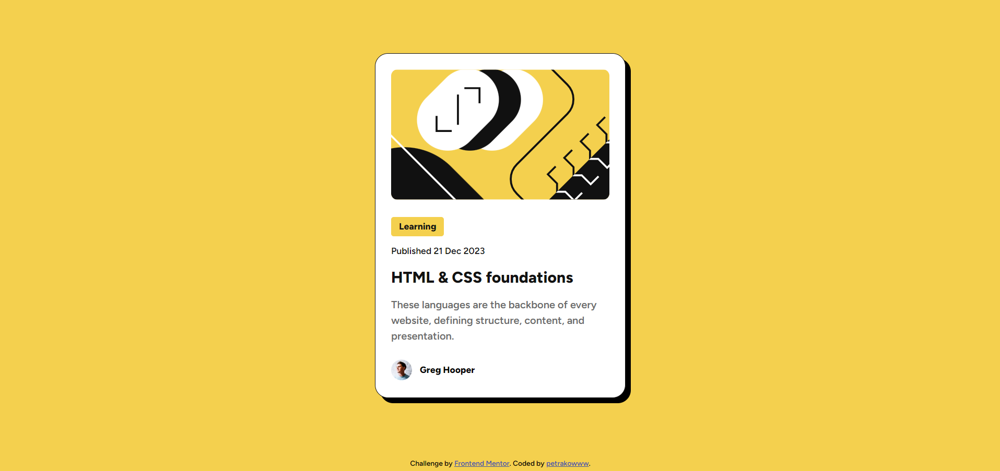

# Компонент "Предварительный просмотр блога" - Решение Frontend Mentor

Это решение
для [челленджа "Blog preview card" на Frontend Mentor]()

## Содержание

- [Обзор](#обзор)
    - [Скриншот](#скриншот)
    - [Ссылки](#ссылки)
- [Мой процесс](#мой-процесс)
    - [Используемые технологии](#используемые-технологии)
    - [Чему я научился](#чему-я-научился)
- [Автор](#автор)

## Обзор

### Скриншот

### Ссылки

- [Репозиторий проекта](https://github.com/Petrakoow/FrontendMentorBlogPreviewCard)
- [Живой пример](https://ваш-сайт.github.io/FrontendMentorProjects)

## Мой процесс

### Используемые технологии

- Семантическая вёрстка HTML5
- CSS для стилизации
- Flexbox для позиционирования
- Media Queries для адаптивного дизайна

### Чему я научился

Этот проект помог мне улучшить навыки работы с CSS Flexbox и Media Queries (Изменено на Clamp).

## Автор

- GitHub - [petrakowww](https://github.com/Petrakoow)
